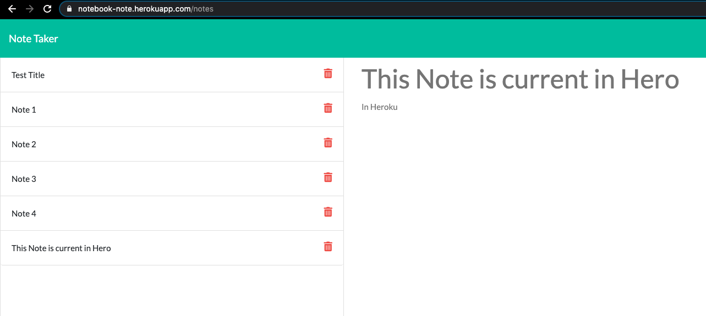

# Note-Taker
---

## Table of Contents
---
* [Description](#Description)
* [Installation](#Installation)
* [Usage](#Usage)
* [Contributors](#Contributors)
* [Test](#Test)
* [License](#License)
* [Questions](#Questions)
* [Demo](#Demo)

## Description 
---
This project is made so that user can generate notes, they will be able to click on the pencil icon and write the title of the notes and notes and hit the save button and the notes will be saved into a json file. That can later be refered back upon redownload. The notes will be given a unique random id that can be used to relook up the notes or delete them.  

## Installation 
---
npm install node when you download the file, this way all the required packages will be loaded into your project to be used. 

## Usage 
---
In order to run the project just type in node server.js and start typing in the notes. 

## Contributors
---
Shubhangi Mundhada

## Test
---
Jest

## License
---
MIT

## Questions
---
Github Link - https://github.com/smundhada
Email - shubhimundhada@gmail.com

## Demo [demo-link](https://notebook-note.herokuapp.com/)
---
